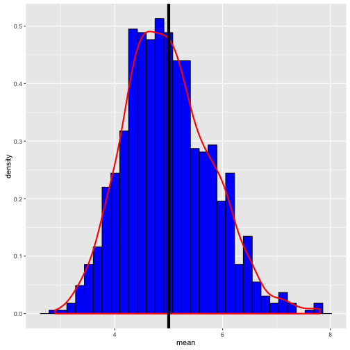
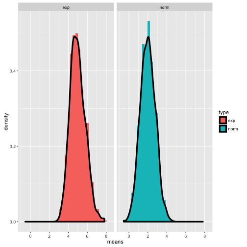

Statistical Inference Assignment
========================================================
#### Naren Vijayakumar


### 1. Exploring Exponential Distribution 

For an exponential distribution with **lambda** as the rate parameter, 
- **Mean = 1/lambda**
- **Std. Dev. = 1/lambda**

So for, lambda = 0.2 , mean = 5.0 and standard deviation = 5.0. Let us see this using simulation. First, we generate 40 random exponentials (with rate, lambda = 0.2) and take a mean of this. We repeat this a 1000 times. This is shown in the R code below:


```r
mns <- sapply(1:1000,function(x) mean(rexp(40,rate=0.2)))
```

By Large of Large Numbers (LLN), mean of the variable should give the ***theoretical mean = 5.0***


```r
#Sample mean is given by
smean <- mean(mns)
smean
```

```
## [1] 4.985233
```

As you can see the sample mean is very close to the theoretical mean.


***standard error (SE) = Theoretical s.d. / sqrt(n) = 5 / sqrt(40) = 0.7905694***

Let us calculate the standard error

```r
se<- sd(mns)
se
```

```
## [1] 0.8010761
```
Again standard error closely matches with the value calculated based on theoritical standard deviation.

Now let us plot the histogram and overlay density distribution over it. A line is drawn it x=5 ie at the theoritical mean.


```r
g <- ggplot(data.frame(x=mns), aes(x)) 
g + geom_histogram(color="black",fill="blue", aes(y=..density..)) + 
    geom_density(color="red",size=1) +
    geom_vline(xintercept=5.0, size=2) +
    labs(x="mean",y="density")
```

 

It is no surprise that center of the distribution is very close to the theoritical mean (black line at x=5) and this plot closely resembles a normal distribtuion thus proving Central Limit Theorem (CLT).


Let us build a distribution by sampling random normal distributions. We will set ***mean = 2.0*** and we want the spread to be 0.8 or we want SE = SD / sqrt(n) = 0.8. In other words ***SD = 0.8 * sqrt(40) = 0.5***


```r
norm_mns <- sapply(1:1000, function(x) mean(rnorm(40,mean=2.0,sd=5.0)))
```

Let us form a data frame with exponential distribution mean and normal distribution mean.   


```r
labels <- c(rep('exp',1000), rep('norm', 1000))
mydf <- data.frame(type=labels, means = c(mns,norm_mns))
```

Let us plot

```r
h <- ggplot(mydf,aes(means,fill=type,y=..density..))
h + geom_histogram() + geom_density(size=1.5) + facet_grid(.~type)
```

```
## `stat_bin()` using `bins = 30`. Pick better value with `binwidth`.
```

 

Plots looks similar as expected.

